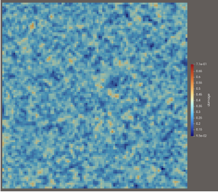
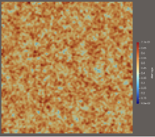

# PorousRVE-MultiPhysics

This project explores how **nanoporous materials** behave when we combine **mechanics**, **plasticity**, **diffusion**, and **swelling** inside a single artificial **Representative Volume Element (RVE)**. Everything is built in **FEniCSx** with a lightweight Python/NumPy pre-processing step.

We systematically build multiphysics complexity:

1️⃣ Generate porous microstructure → damage  
2️⃣ Elastic mechanics → stress redistribution  
3️⃣ Plasticity → permanent deformation near pores  
4️⃣ Diffusion → damaged pathways act as transport channels  
5️⃣ Swelling → concentration induces stress

---

## 🚧 1) Porous RVE generation (Python/NumPy)

We start from a uniform square grid of quadrilateral elements and remove bonds randomly to introduce porosity.

**Damage per cell** is defined as:

$$
d = \frac{N_{\text{broken}}}{N_{\text{total}}}, \quad 0 \le d \le 1
$$

where:
- \(d=0\): intact
- \(d \to 1\): highly damaged / porous

**Outputs**
- Mesh (nodes + elements)
- Damage field \(d(x)\) per cell (XDMF or VTK)

**How it’s solved**
1. Create regular grid + connectivity
2. Randomly break bonds according to target porosity \(\phi\)
3. Count broken bonds around each element
4. Save mesh + damage as finite-element readable fields

**Figures**
- Damage at $\phi = 0.3$  
  

- Damage at $\phi = 0.5$  
  

---

## 🧱 2) Linear elasticity (FEniCSx)

Damage reduces stiffness:

$$
\mathbb{C}_{\text{eff}}(d) = (1-d)^p \, \mathbb{C}_0
$$

Boundary conditions:
- Left boundary fixed (avoid rigid motion)
- Right boundary tension via displacement or traction

Governing equation:

$$
\nabla \cdot \boldsymbol{\sigma}(\mathbf{u},d) = \mathbf{0}
$$

Stress–strain relation:

$$
\boldsymbol{\sigma} = \mathbb{C}_{\text{eff}}(d) : \boldsymbol{\varepsilon}(\mathbf{u}),
\qquad
\boldsymbol{\varepsilon}(\mathbf{u}) =
\frac{1}{2}\left(\nabla \mathbf{u} + \nabla \mathbf{u}^T\right)
$$

**What you observe**
- Stress bypasses weak, porous regions
- Load flows along **continuous stiff channels**

**Figure**

---

## 🔩 3) J2 plasticity with isotropic hardening

Yield criterion (von Mises):

$$
\sigma_{\text{eq}} = \sqrt{\frac{3}{2}\boldsymbol{s}:\boldsymbol{s}}
$$

Hardening:

$$
\sigma_y(\alpha) = \sigma_{y0} + H_{\text{iso}} \alpha
$$

Solved using:
- **Return-mapping** at quadrature points
- Newton iterations assembling elastoplastic tangent

**Outputs**
- Plastic strain \(\varepsilon^p\)
- Updated stress \(\sigma\)
- Dissipated + stored energy

**Figure**

---

## 🌫 4) Transient diffusion in damaged media

Transport coefficient depends on damage:

$$
D(d) = D_{\text{matrix}} +
\left(D_{\text{pore}} - D_{\text{matrix}}\right)d^{q_D}
$$

Diffusion equation:

$$
\frac{\partial c}{\partial t}
=
\nabla \cdot \big(D(d)\nabla c \big)
$$

Temporal discretization:
- **Implicit Backward Euler** (stable & robust)

Outputs:  
- Concentration field \(c(x,t)\) (XDMF time-series)

**What you observe**
- Damage acts as **fast-diffusion channels**

**Figure**

---

## 💧 5) Chemomechanical swelling

Transport induces volumetric swelling:

$$
\varepsilon_{\text{sw}}(c) = \beta \, c \, \mathbf{I}
$$

Total strain split:

$$
\varepsilon_{\text{tot}} =
\varepsilon(\mathbf{u}) - \varepsilon_{\text{sw}}(c)
$$

Stress:

$$
\boldsymbol{\sigma}_{\text{tot}}
=
\mathbb{C}_{\text{eff}}(d) :
\left(\varepsilon(\mathbf{u}) - \beta c \mathbf{I} \right)
$$

➡ **Minus sign** because swelling is treated as an **eigenstrain**
→ internal stress is generated if swelling is constrained

**Figure**

---

## 🎯 Key Takeaways

| Physics | What happens in nanoporous materials? |
|--------|---------------------------------------|
| Elasticity | Stress avoids weak damaged zones |
| Plasticity | Permanent deformation localizes near pores |
| Diffusion | Damaged links = transport highways |
| Swelling | Concentration gradients → tensile stress |

This modular workflow helps analyze switching mechanisms and micro-scale coupling in water-driven materials.

---

## 🔧 Tech

- **FEniCSx** (mechanics + diffusion)
- **MPI + PETSc** (parallel linear solvers)
- **NumPy** (geometry & bond-based damage)
- Output format: **XDMF/HDF5** (Paraview-friendly)

---

### 📌 To-Do / future extensions

- Full **two-way** chemomechanical coupling  
- Non-local or phase-field fracture damage  
- 3D porous RVEs  

---

If you use or extend this repo, feel free to open a PR or issue 🚀  
Happy simulation! 🔬
